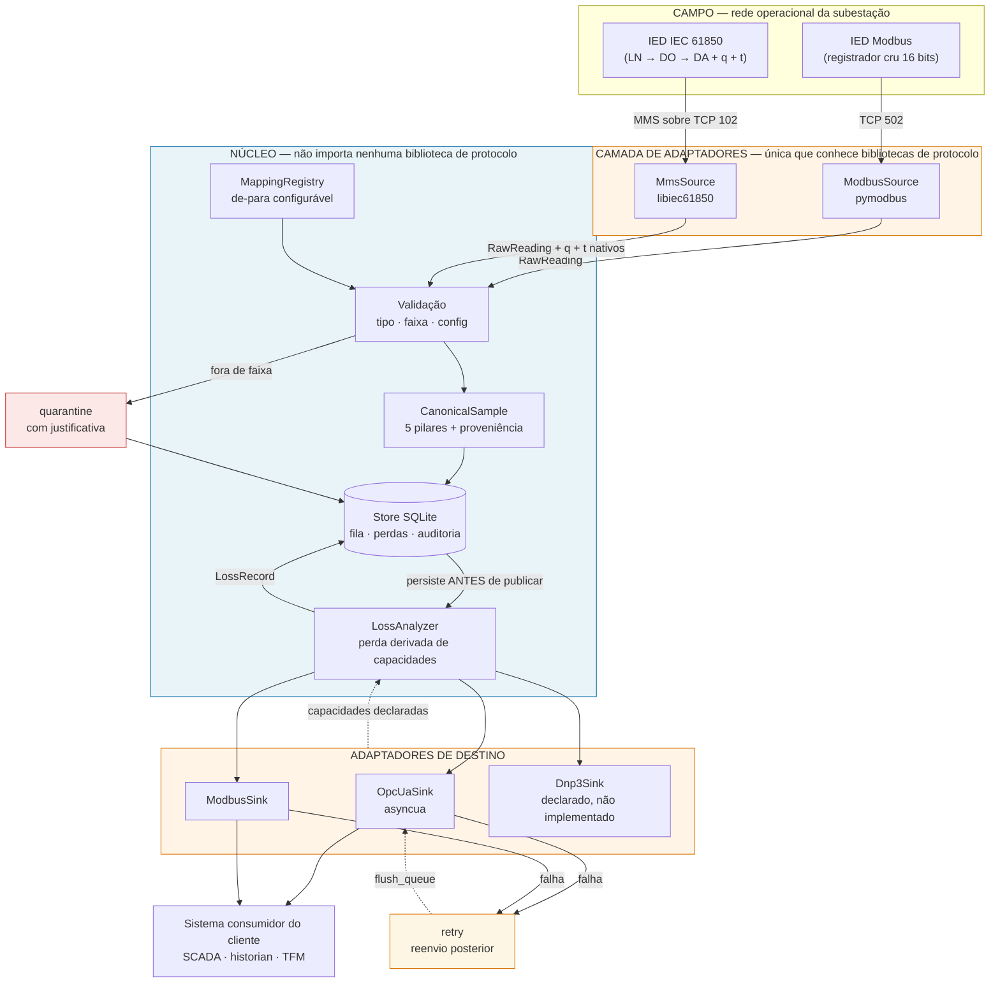
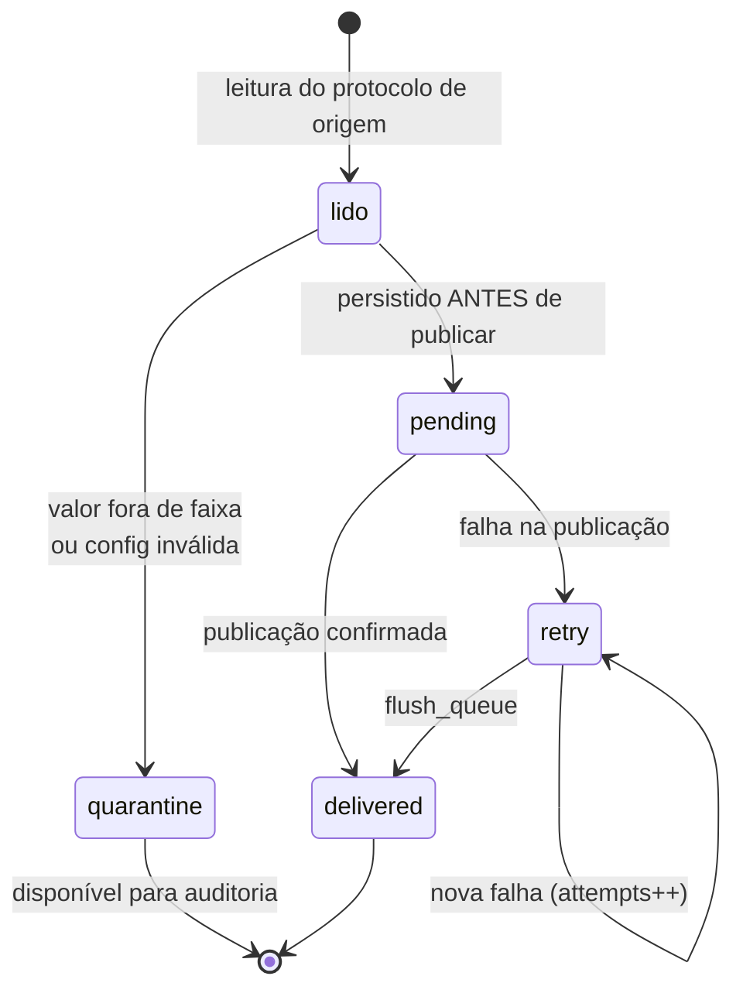

# Gateway Multiprotocolo com Rastreabilidade de Perda Semântica

**Hackathon Integre JR 2026 — Desafio WEG**
Sistema Multiprotocolo de Comunicação para Dispositivos Industriais

---

## O problema em uma frase

A mesma grandeza física — a temperatura do óleo de um transformador — é representada de
formas estruturalmente incompatíveis em cada protocolo industrial. Converter entre eles
não é traduzir pacotes: é **reconstruir significado**, e toda reconstrução ou descarta
informação ou inventa informação. Hoje isso acontece de forma silenciosa.

**A tese desta solução:** nenhum dado pode desaparecer em silêncio. Todo evento está
sempre em um estado verificável, e toda degradação semântica é registrada com
justificativa, valor de origem, valor de destino e a versão da regra que a causou.

---

## Arquitetura



### Por que o núcleo não depende de bibliotecas de protocolo

Requisito da WEG: *"as estratégias abordadas não deverão depender diretamente de
bibliotecas atreladas aos protocolos industriais"*.

`core/` não contém nenhum `import pymodbus`, `import pyiec61850` ou `import asyncua`.
A fronteira é `core/ports.py`. Um adaptador usa a biblioteca **por dentro** e devolve
apenas `RawReading` / recebe apenas `CanonicalSample`.

**Teste da régua:** trocar `pymodbus` por outra biblioteca de Modbus altera exatamente
um arquivo — `adapters/modbus_source.py`. Nenhuma linha do núcleo muda.

---

## O modelo canônico — os 5 pilares

| Pilar | Campo | Observação |
|---|---|---|
| 1. Significado | `SemanticRef` (asset_id, asset_type, measurement, iec61850_hint) | o que o número representa no mundo físico |
| 2. Tipo | `DataType` | explícito, independente do encoding de origem |
| 3. Unidade | `unit` | unidade de engenharia |
| 4. Qualidade | `Quality` (validity + detail + **origin**) | `origin` diz se veio do fio ou foi assumida |
| 5. Timestamp | `Timestamp` (value + **origin**) | `origin` diz se é o instante real ou o de recebimento |

O campo **`origin`** é a peça central. Um timestamp preenchido pelo gateway não é
apresentado como se fosse o instante real da medição — ele é marcado como aproximado,
e essa aproximação vira um registro de perda do tipo `SYNTHESIZED`.

---

## Detecção de perda: declarativa, não hard-coded

Cada adaptador de destino **declara o que consegue representar**:

| Protocolo | Qualidade | Timestamp | Unidade | Modelo semântico | Bits |
|---|---|---|---|---|---|
| OPC UA | sim | sim | sim | sim | 64 |
| Modbus | **não** | **não** | **não** | **não** | 16 |
| DNP3 *(não implementado)* | sim | sim | **não** | **não** | 32 |

O `LossAnalyzer` compara a amostra canônica com essas capacidades e **deriva** a perda.
Não existe regra escrita por par de protocolos — por isso o DNP3, sem nenhuma linha de
pilha implementada, já é analisado corretamente apenas por ter declarado suas
capacidades. **Um protocolo novo ganha análise de perda de graça.**

### Tipos de perda registrados

| Tipo | Significado |
|---|---|
| `DROPPED` | existia na origem, não cabe no destino |
| `APPROXIMATED` | representado com menor fidelidade |
| `SYNTHESIZED` | não existia na origem, foi preenchido pelo gateway |
| `DEGRADED` | taxonomia rica reduzida a uma pobre |

---

## Ciclo de vida do evento



Garantia oferecida: **entrega pelo menos uma vez, com detecção de duplicidade por
`event_id`**. Não prometemos *exactly-once* — é caro e desnecessário para telemetria.

---

## Escopo do protótipo

**Coberto:** telemetria e monitoramento (somente leitura).

**Explicitamente fora de escopo:** comandos, atuação, escrita em registradores de campo,
controle remoto, alteração de configuração de IED. Isso elimina toda a classe de
problemas de *select-before-operate*, idempotência de comando e responsabilidade por
atuação incorreta — que não cabem em um protótipo e não são o problema apresentado.

**Implementado de fato:** Modbus TCP e IEC 61850 MMS como origens; OPC UA e Modbus como
destinos.
**Declarado na arquitetura, não implementado:** DNP3 (capacidades declaradas, caminho de
implementação documentado em `adapters/dnp3_sink.py`).

> Sobre o DNP3: a pilha de referência `OpenDNP3` está **arquivada** no GitHub desde
> 2022-05-18 e o binding Python `pydnp3` teve sua última versão publicada no PyPI em
> 2018-06-01 (verificado em 2026-09-19). Colocar o caminho crítico sobre uma dependência
> morta seria imprudente.

---

## Como rodar

### Pré-requisitos
- WSL2 com Ubuntu (ou Linux nativo)
- `build-essential`, `cmake`, `swig`, `python3-dev`

### 1. Compilar a pilha IEC 61850
```bash
sudo apt-get install -y build-essential cmake git swig python3-dev python3-venv
mkdir -p ~/vendor && cd ~/vendor
git clone --depth 1 https://github.com/mz-automation/libiec61850.git
cd libiec61850/third_party/mbedtls
wget https://github.com/Mbed-TLS/mbedtls/archive/refs/tags/v3.6.0.tar.gz
tar xzf v3.6.0.tar.gz && rm v3.6.0.tar.gz
cd ../.. && mkdir build && cd build
cmake .. -DCMAKE_BUILD_TYPE=Release -DBUILD_PYTHON_BINDINGS=ON
make -j$(nproc)
```
> O mbedtls é necessário porque o binding Python referencia símbolos de R-GOOSE que só
> são compilados com TLS disponível.

### 2. Ambiente Python
```bash
python3 -m venv ~/venv-weg
~/venv-weg/bin/pip install pymodbus asyncua pyyaml ruamel.yaml
```

### 3. Subir os IEDs simulados e rodar a demonstração
```bash
bash run_demo.sh
```

### 4. Interface de cadastro
```bash
python cli.py listar
python cli.py ver TR02_OIL_TEMP_MMS
python cli.py validar --arquivo config/points_invalid.yaml
python cli.py capacidades
python cli.py perdas
python cli.py fila

python cli.py cadastrar --point-id TR03_TEMP \
    --source-protocol modbus --source-device IED-MODBUS-02 \
    --source-address 40020 --asset-id TR-03 --asset-type power_transformer \
    --measurement winding_temperature --unit Cel --scale 0.1 \
    --target-protocol opcua --target-address TR-03.WindingTemp

python cli.py alterar TR03_TEMP --scale 0.5
python cli.py remover TR03_TEMP
```

---

## Os cinco cenários demonstrados

| # | Cenário | Prova |
|---|---|---|
| 1 | **Modbus → OPC UA** (pobre→rico) | registrador `253` → `25.3 Cel`; qualidade e timestamp **sintetizados e marcados** |
| 2 | **IEC 61850 → Modbus** (rico→pobre) | qualidade e timestamp **nativos** do IED → **5 perdas registradas** |
| 2b | **IEC 61850 → OPC UA** (rico→rico) | *zero perda* — mesma origem, destino diferente, resultado oposto |
| 3 | **Configuração inválida** | 4 pontos rejeitados com motivo; os válidos seguem operando |
| 4 | **Valor fora de faixa** | `9999 Cel` → quarentena com justificativa, **não descarte** |
| 5 | **Destino fora do ar** | 5 eventos enfileirados → religa → 5 reenviados, **0 perdidos** |

O contraste entre **2** e **2b** é a prova de que a análise de perda é derivada do
modelo, não escrita à mão: mesma origem, dois destinos, perfis de perda completamente
diferentes.

---

## Estrutura

```
core/                 núcleo — sem dependência de protocolo
  canonical.py        modelo canônico, os 5 pilares, MetadataOrigin
  ports.py            interfaces SourceAdapter / SinkAdapter / SinkCapabilities
  loss.py             LossAnalyzer — perda derivada de capacidades
  registry.py         de-para configurável + validação
  store.py            fila persistente, perdas, auditoria encadeada
  engine.py           orquestração do ciclo de vida do evento

adapters/             única camada que conhece bibliotecas de protocolo
  modbus_source.py    pymodbus
  mms_source.py       libiec61850 (q e t nativos)
  opcua_sink.py       asyncua
  modbus_sink.py      codificação para registrador 16 bits
  dnp3_sink.py        declarado, não implementado

config/
  points.yaml         o de-para
  points_invalid.yaml cenário de configuração inválida

sim/modbus_server.py  IED Modbus simulado
demo.py               os 5 cenários
cli.py                interface de cadastro
```

---

## Limitações conhecidas

Ditas de forma explícita, porque um protótipo que esconde limitação não é defensável:

1. **Não substitui um conversor industrial certificado.** Certificação IEC 61850,
   robustez elétrica, isolamento, redundância e interoperabilidade testada com múltiplos
   fabricantes não estão no escopo. O que o protótipo demonstra é que a **lógica de
   tradução semântica** pode rodar em software, sobre infraestrutura computacional que a
   WEG já possui.
2. **O mapa de registradores do `ModbusSink` é mantido em memória.** Expô-lo como
   servidor Modbus TCP usa o mesmo `StartTcpServer` do simulador — é uma chamada, não uma
   mudança de arquitetura.
3. **DNP3 e OPC UA como origem não estão implementados** — apenas previstos.
4. **Sem TLS nas conexões industriais do protótipo.** A `libiec61850` foi compilada com
   mbedtls (TLS 1.3 disponível), e a arquitetura prevê IEC 62351-3, mas a demonstração
   roda em rede isolada.
5. **Controle de acesso é uma allowlist simples** de dispositivos, inspirada no princípio
   de negação por padrão — não é conformidade com IEC 62351-8.
